# Tic Tac Toe

A Flutter Tic Tac Toe game built with Riverpod.

## Features

- **Two Game Modes**: Player vs Player and Player vs AI
- **Smart AI**: Uses strategic move selection (win/block/center/corner strategy)
- **Score Tracking**: Persistent win/loss/draw statistics
- **Game Persistence**: Save and resume games using SharedPreferences
- **Settings**: Language selection (English, French, or System default)
- **Internationalization**: English and French language support
- **Modern UI**: Dark theme with basic smooth animations

## Architecture

This project follows **Clean Architecture** with a feature-based folder structure.

### Architecture Diagram

```mermaid
graph TB
    subgraph Presentation["🎨 Presentation Layer"]
        Pages["Pages<br/>(GamePage, SettingsPage)"]
        Widgets["Widgets<br/>(BoardWidget, CellWidget)"]
        Providers["Providers<br/>(GameNotifier, LocaleNotifier)"]
    end

    subgraph Domain["📐 Domain Layer"]
        Entities["Entities<br/>(Game, Board, Player)"]
        UseCases["Use Cases<br/>(PlayMove, CheckWinner, GetAiMove)"]
        RepoInterfaces["Repository Interfaces"]
    end

    subgraph Data["💾 Data Layer"]
        Repositories["Repository Implementations"]
        DataSources["Data Sources<br/>(SharedPreferences)"]
        Models["Models<br/>(GameModel)"]
    end

    subgraph Core["⚙️ Core"]
        Router["GoRouter"]
        Theme["Theme"]
        L10n["Localization"]
        Extensions["Extensions"]
        Animations["Animations"]
    end

    Pages --> Providers
    Widgets --> Providers
    Providers --> UseCases
    UseCases --> RepoInterfaces
    RepoInterfaces -.->|implements| Repositories
    Repositories --> DataSources
    Repositories --> Models

    Pages --> Core
    Providers --> Core

    style Presentation fill:#4CAF50,color:#fff
    style Domain fill:#2196F3,color:#fff
    style Data fill:#FF9800,color:#fff
    style Core fill:#9C27B0,color:#fff
```



### Data Flow

```mermaid
sequenceDiagram
    participant UI as 🎨 UI (Widget)
    participant P as 📱 Provider
    participant UC as 📐 Use Case
    participant R as 💾 Repository
    participant DS as 🗄️ DataSource

    UI->>P: User Action (tap cell)
    P->>UC: Execute Use Case
    UC->>R: Call Repository
    R->>DS: Read/Write Data
    DS-->>R: Return Result
    R-->>UC: Return Entity
    UC-->>P: Return Result
    P-->>UI: Update State
```



### Folder Structure

```
lib/
├── main.dart
├── app.dart
├── constants/                          # App-wide constants
├── core/
│   ├── extensions/                    # BuildContext extensions (l10n)
│   ├── l10n/                          # Localization (ARB files + generated)
│   ├── observer/                      # Riverpod & Navigator observers
│   ├── providers/                     # Core providers (SharedPreferences)
│   ├── router/                        # GoRouter configuration
│   ├── theme/                         # Design system
│   ├── ui/
│   │   ├── widgets/                   # Shared UI components (loading, dialogs, etc.)
│   │   └── animations/                # Shared animations
│   └── utils/                         # Logger and utilities
└── features/
    ├── game/
    │   ├── data/                      # Models, repositories, datasources
    │   ├── domain/                    # Entities, use cases, repository interfaces
    │   └── presentation/              # Pages, widgets, providers
    └── settings/
        ├── data/                      # Settings repository, datasource
        ├── domain/                    # AppLocale entity, repository interface
        └── presentation/              # Settings page, providers, widgets
```

### Key Architectural Decisions

- **Riverpod** for state management with `@riverpod` annotations
- **GoRouter** for navigation with redirect-based navigation logic
- **Freezed** for immutable data models with JSON serialization
- **Flutter Localizations** for i18n with ARB files
- **Use Cases** for encapsulating business logic
- **Repository Pattern** with abstraction for testability

## Getting Started

### Prerequisites

- [FVM](https://fvm.app/) (Flutter Version Management)
- Flutter 3.38.6 (managed by FVM)

### Installation

```bash
# Install the correct Flutter version
fvm install

# Get dependencies
fvm flutter pub get

# Generate code (freezed, json_serializable, riverpod_generator)
fvm dart run build_runner build --delete-conflicting-outputs

# Generate localization files
fvm flutter gen-l10n

# Run the app
fvm flutter run
```

### Development Commands

```bash
# Analyze code
fvm flutter analyze

# Run tests
fvm flutter test
```

## Localization

Translations are stored in `lib/core/l10n/` as ARB files:

- `app_en.arb` - English (template)
- `app_fr.arb` - French

To add a new language, create `app_xx.arb` and run `flutter gen-l10n`.

Usage in widgets:

```dart
import 'package:tic_tac_toe/core/extensions/extensions.dart';

Text(context.l10n.appTitle)
```

## Dependencies

- `flutter_riverpod` - State management
- `riverpod_annotation` - Code generation for Riverpod
- `go_router` - Declarative routing
- `freezed_annotation` - Immutable classes
- `json_annotation` - JSON serialization
- `shared_preferences` - Local storage
- `flutter_localizations` - Internationalization

## Project Structure Details

### Domain Layer

- **Entities**: `Player`, `Board`, `Game`, `GameMode`, `GameStatus`, `AiDifficulty`, `AppLocale`
- **Use Cases**: `PlayMove`, `CheckWinner`, `GetAiMove`, `SaveGame`, `LoadGame`
- **Repository Interfaces**: `GameRepository`, `SettingsRepository`

### Data Layer

- **Models**: `GameModel` (Freezed with JSON serialization)
- **Data Sources**: `GameLocalDataSource`, `SettingsLocalDataSource` (SharedPreferences wrappers)
- **Repository Implementations**: `GameRepositoryImpl`, `SettingsRepositoryImpl`

### Presentation Layer

- **Pages**: `GameIntroPage`, `GamePage`, `GameOverPage`, `SettingsPage`
- **Widgets**: `BoardWidget`, `CellWidget`, `ScoreWidget`, `LanguageTile`
- **Providers**: `GameNotifier` for game state, `LocaleNotifier` for language settings
